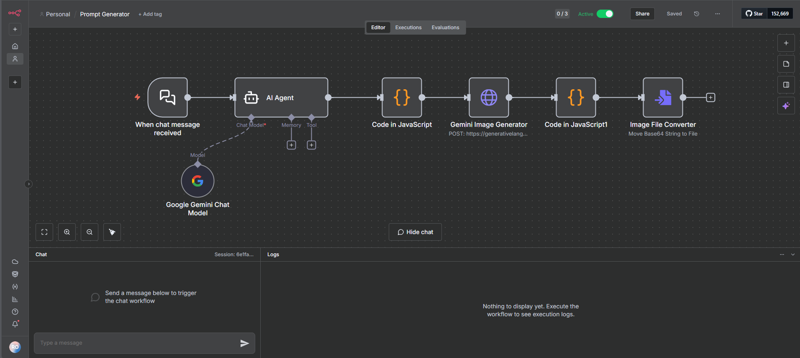
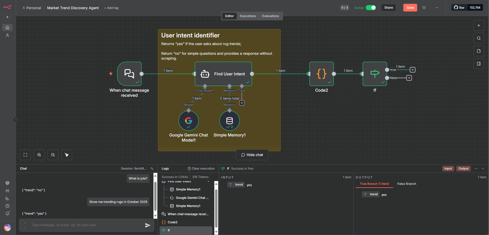
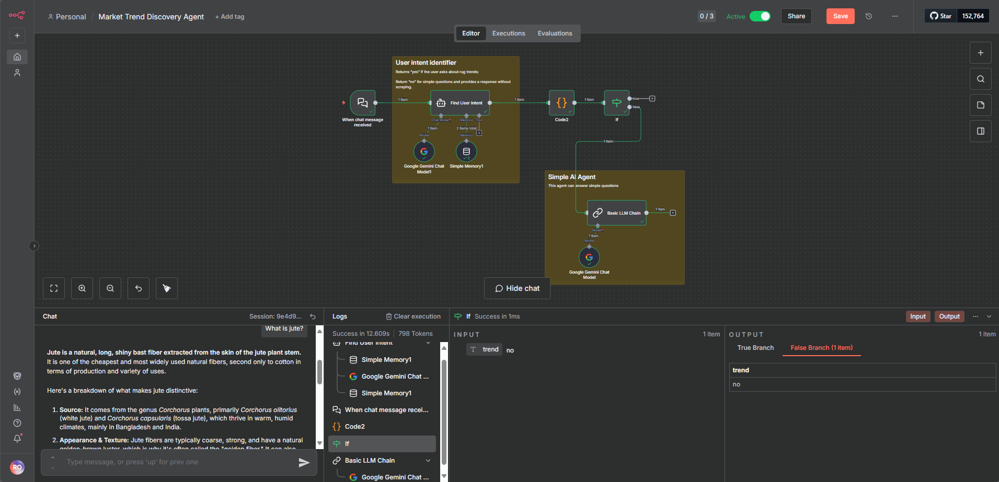
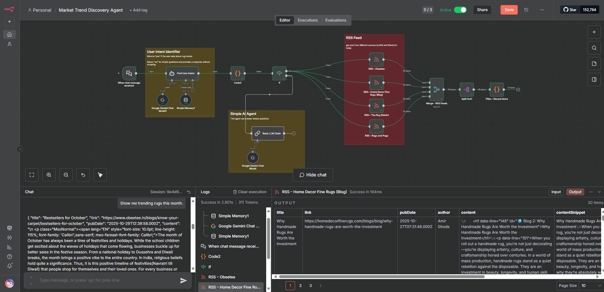
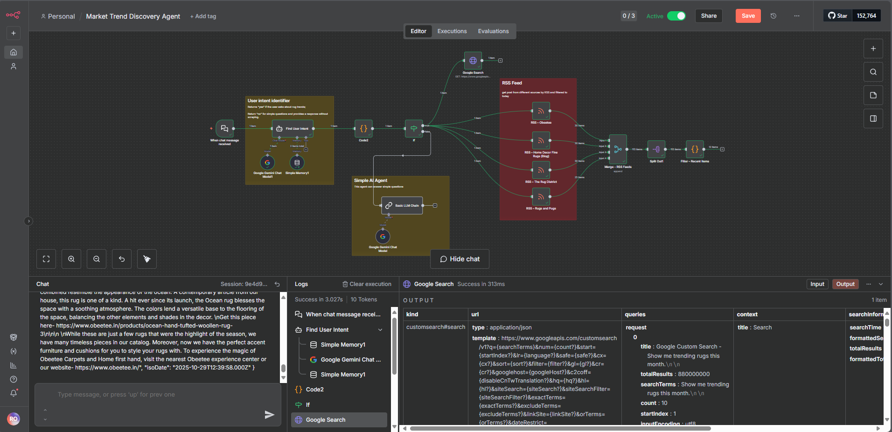
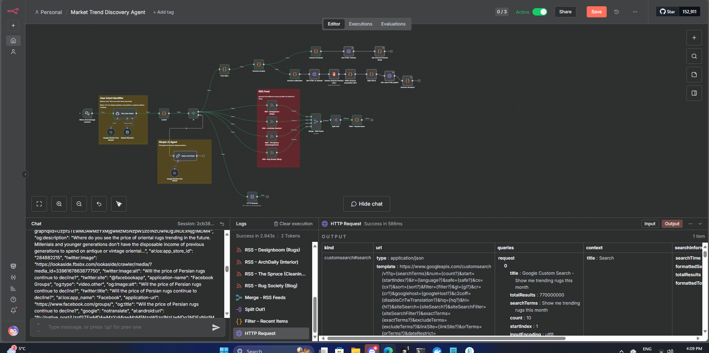
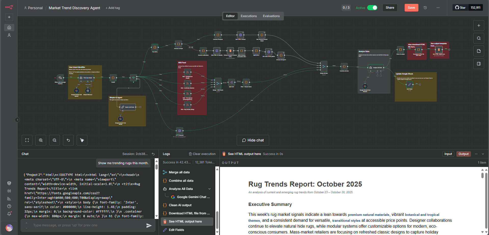

# Wayfair AI Automation Externship

**Program:** Extern – Wayfair AI Automation Externship  
**Duration:** Oct 27 – Dec 22, 2025  
**Program Manager:** Christie Andersen  
**Progress:** ✅ Project 1 done | ✅ Project 2 done | ✅ Project 3 done | ✅ Project 4 done | 🚧 Project 5 in progress | 🏁 Goal: Professional Award

---

## 📘 Overview

This repository documents my progress through the **Wayfair AI Automation Externship**, an 8-week experience focused on **AI agents, data automation, and trend discovery**.

Each project builds on the last:

1. **Orientation:** Program setup & goals  
2. **Moodboard Generator Agent:** Prompts → Gemini image generation → visual moodboard  
3. **Consumer Trend Discovery Agent:** Detect design trends via blogs, RSS feeds, and search  
4. **Competitor Monitoring Agent:** Scrape and analyze competitor data from Wayfair and Amazon, generate competitive intelligence reports  
5. **AI Insights & Content Agent:** Transform trend and competitor data into creative marketing content aligned with Wayfair's brand voice  
6. **Market Intelligence Dashboard:** Integrate all agents into a unified Supabase database and create a live Google Sheets dashboard

---

## 🧠 Tools & Tech

- **n8n** (workflow automation)
- **Google Gemini API** (LLM + image generation)
- **Python / JS snippets** (data cleaning, API parsing)
- **Web scraping + RSS feeds**
- **Streamlit or simple HTML dashboards**

---

## 🗓 My Progress

### Week 1 – Orientation
- Reviewed program materials and met Program Manager Christie Andersen
- Set up n8n Cloud account and obtained Google Gemini API key
- Built basic "Hello World" workflow to test node connections
- Joined Slack community and familiarized with externship structure

### Week 2 – Project 1: Moodboard Generator ✅
**Goal:** Build an AI workflow that turns a short style idea into a moodboard using n8n and Google Gemini.

**Workflow:** `When chat message received → AI Agent (Gemini Chat Model) → Code (clean prompt) → HTTP Request (Gemini Image API) → Code (parse) → Image File Converter`

**Result:** Generated moodboard images from prompts like "Bohemian rugs, neutral tones." Encountered API rate limits but confirmed full end-to-end workflow execution.

**Screenshot:** 

**Skills learned:** Building low-code AI agents with n8n, prompt engineering for visuals, handling API calls & rate-limit debugging, JSON parsing and data transformation

### Week 3-4 – Project 2: Consumer Trend Discovery Agent ✅
**Goal:** Build an AI agent that detects user intent, scrapes live product data, reads RSS feeds, performs Google searches, and generates intelligent HTML trend reports.

**Workflow Steps:**
1. **Intent Detection:** AI agent classifies queries as "trend" or "non-trend" using Google Gemini, routing workflows accordingly
2. **Smart Non-Trend Responses:** Direct conversational answers for FAQs without triggering data-heavy searches
3. **RSS Feed Integration:** Multiple RSS Feed Read nodes capture real-time industry signals from design blogs (Dezeen, Design Milk, Nazmiyal, etc.)
4. **Google Search:** Google Custom Search API fetches live web results for trend-related queries
5. **Amazon Scraping:** Web scraping extracts product-level data (prices, features, descriptions) from Amazon product and collection pages
6. **Final Analysis & System Message:** Merges all data sources, adds a system message to define the agent's identity (expert trend analyst), boundaries (rugs category, last 7 days), output format (HTML report with executive summary), and editorial judgment. Generates comprehensive HTML trend reports structured like a Wayfair insight deck

**Result:** Complete end-to-end agent that transforms user queries into structured trend intelligence. Successfully tested with competitor analysis on Amazon rug listings, generating detailed reports that combine RSS signals, Google search results, and live product data.

**Screenshots:**
- Step 1: 
- Step 2: 
- Step 3: 
- Step 4: 
- Step 5: 
- Step 6: 

**Documentation & Reports:**
- [Final Trend Report](./docs/project2/final_trend_report.pdf) - Generated trend analysis report from competitor analysis
- [System Messages Management](./docs/project2/system_messages_management.pdf) - System message variations and experiments (Step 6)

**Skills learned:** Intent detection and workflow routing, RSS feed aggregation, API integration (Google Custom Search), web scraping (product/collection pages), data normalization and merging, system message design for AI agents, HTML report generation, end-to-end AI agent architecture

### Week 5-6 – Project 3: Competitor Monitoring Agent ✅
**Goal:** Build an AI agent that monitors competitors by scraping product data from Wayfair and Amazon, merging the data, and generating actionable competitive intelligence reports.

**Workflow Steps:**
1. **Manual Competitor Analysis:** Analyzed Amazon's rugs category with 22 observations (pricing, features, messaging, tactics)
2. **Wayfair Scraper:** Built scraper to extract product data from Wayfair's rug listings (48 products scraped)
3. **Amazon Scrapers:** Reused and enhanced Amazon scrapers from Project 2, including Fallback Scraper for resilience
4. **Data Merging:** Combined Wayfair and Amazon data streams using Merge nodes
5. **AI Analysis:** Configured AI Agent with system messages to analyze competitor data and generate insights
6. **Report Generation:** Produced HTML reports with competitive landscape, benchmark summaries, and actionable recommendations

**Result:** Complete Competitor Monitoring Agent that scrapes, merges, and analyzes competitor data to identify pricing gaps, feature trends, and whitespace opportunities for Wayfair.

**Screenshots:**
- Step 1: 
- Step 2: 
- Step 3: 
- Step 4: 
- Step 5: 

**Documentation & Reports:**
- [Final Competitor Report (PDF)](./docs/project3/competitor_monitoring_agent_report.pdf) - Generated competitive intelligence report
- [Final Competitor Report (HTML)](./docs/project3/final_competitor_report.html) - HTML version of the report
- [Competitor Analysis Data](./docs/project3/competitor_manual_analysis_data.csv) - 22 observations from manual analysis

**Skills learned:** Manual competitive analysis, multi-source web scraping (Wayfair + Amazon), data merging and normalization, resilient scraper architecture (Fallback Scraper), system message experimentation, competitive intelligence report generation, signal vs noise analysis

### Week 7-8 – Project 4: AI Insights & Content Agent ✅
**Goal:** Refine a pre-built AI Insights & Content Agent to transform trend and competitor data into creative marketing content that aligns with Wayfair's brand voice and tone.

**Workflow Steps:**
1. **Import and Explore:** Imported pre-built workflow JSON, explored workflow structure and node connections, renamed workflow to `Wayfair_ContentAgent`
2. **Evaluate Output:** Ran agent with test input (bohemian rugs from Amazon), generated content output, created evaluation Google Doc with observations, documented first impressions and agent analysis
3. **Teaching Your Agent Creative Thinking:**
   - **Studying Wayfair's Content & Voice:** Analyzed Wayfair blog post ("Ask an Editor: How to Flatten a Rug") and Instagram reel to understand brand voice (warm, inviting, confident, aspirational yet relatable)
   - **Creative Translation Layer:** Transformed data insights into creative marketing content with "why" context
   - **Rewriting System Messages:** Created 4 System Message variations:
     - V1: Pricing Strategy Focus (Analytical + Creative Mix)
     - V2: Feature Differentiation Focus (Lifestyle Benefits)
     - V3: Messaging & Imagery Focus (Aspirational yet Relatable) ⭐
     - V4: Emerging Trends Focus (Trend Storytelling)
4. **Run and Compare Creative Outputs:** Tested all 4 System Message variations with the same input data, generated comparison document, documented tone differences and content focus shifts, identified V3 as most authentic to Wayfair's brand voice
5. **Submit Your Updated AI Insights & Content Agent:** Refined final system message, generated final content output ("Wayfair Rugs Content Strategy: Dream Home, Real Life"), exported PDF report, recorded Loom video walkthrough, organized all documentation

**Result:** Complete AI Insights & Content Agent that transforms trend signals and competitor data into brand-aligned marketing content. The agent generates blog post strategies, Instagram captions, and creative content ideas that balance aspiration with relatability—matching Wayfair's authentic brand voice.

**Key Workflow Components:**
- **Find URLs:** Detects and classifies Amazon and Walmart product/collection URLs from input text
- **Web Scrapers:** Scrapes product and collection data from Amazon and Walmart (with error handling for bot protection)
- **Data Processing:** Extracts trend signals (consumer preferences, style trends, competitor benchmarks)
- **AI Agent:** Uses refined system message to transform signals into creative marketing content
- **Output Generation:** Produces HTML-formatted content with embedded CSS (blog posts, Instagram captions, styling tips)

**Screenshots:**
- Workflow: 
- Evaluation: 
- Brand Voice Analysis: 
- System Variation Analysis: 
- Loom Video: 

**Documentation & Reports:**
- [Final System Message](./docs/project4/final_system_message.md) - Refined system message with brand voice alignment
- [System Message Variations](./docs/project4/system_message_variations.md) - All 4 variations tested
- [Wayfair Brand Voice Analysis](./docs/project4/wayfair_voice_analysis.md) - Analysis of Wayfair's content and voice
- [Final Content Output (HTML)](./docs/project4/final_content_output.html) - Generated blog post and Instagram captions
- [Final AI Insights Report (PDF)](./docs/project4/final_ai_insights_content_report.pdf) - PDF version of generated content
- [Creative Outputs Comparison](https://docs.google.com/open?id=15VvEtWNNzFoyMgUbHr_xM35rNXH-MWJxvxf8NGyQojI) - Google Doc comparing all 4 variations
- [Loom Video Walkthrough](https://www.loom.com/share/088acce7cad74119a47e76129c9a0286) - Full workflow demo

**Skills learned:** Brand voice analysis and translation, system message engineering and prompt design, creative content generation from data insights, A/B testing system message variations, HTML/CSS formatting for AI outputs, debugging web scraping (URL detection, domain variations, bot protection), transforming analytical data into storytelling content, balancing aspiration with relatability in brand messaging

### Week 9-10 – Project 5: Market Intelligence Dashboard 🚧
**Goal:** Unify all previous workflows (Projects 2, 3, and 4) into a single live pipeline using Supabase database, creating a unified Market Intelligence Dashboard that delivers real-time insights for Wayfair's Rugs team.

**Workflow Steps:**
1. **Supabase Setup:** Created Supabase account, organization (Extern), and project (Wayfair)
2. **Database Table:** Created `agent_output` table with columns: `id`, `output_text`, `agentId`, `input_text`
3. **Project 2 Integration:** Connected Trend Discovery Agent to Supabase (agentId = 2)
   - Added Code node to tag outputs with agent_id
   - Added Supabase Get/Update/Create nodes for data persistence
   - Converted PDF output to HTML for consistency
4. **Project 3 Integration:** Connected Competitor Monitoring Agent to Supabase (agentId = 3)
   - Updated Code node with agent_id = 3
   - Connected Supabase nodes with agentId = 3
5. **Project 4 Integration:** Connected AI Insights & Content Agent to Supabase (agentId = 4)
   - Updated Code node with agent_id = 4
   - Connected Supabase nodes with agentId = 4
6. **Data Flow Validation:** Verified all 3 agents successfully store outputs in Supabase

**Result:** All three agents (Trend Discovery, Competitor Monitoring, Content Generation) now store their outputs in a unified Supabase database. Each agent maintains one row that gets updated on each run, creating a persistent memory system for market intelligence.

**Database Structure:**
- **agent_output table:** Centralized storage for all agent outputs
- **agentId mapping:**
  - `agentId = 2`: Project 2 (Trend Discovery Agent)
  - `agentId = 3`: Project 3 (Competitor Monitoring Agent)
  - `agentId = 4`: Project 4 (AI Insights & Content Agent)

**Screenshots:**
- Supabase Table Editor:  - Shows the `agent_output` table with data from all 3 agents (agentId 2, 3, 4)
- Supabase Integration Nodes:  - Shows the Supabase nodes (Get a row, If, Update a row, Create a row) integrated into the workflow
- Google Sheets dashboard (to be added)

**Documentation & Resources:**
- [Project 5 README](./docs/project5/README.md) - Complete integration guide and step-by-step instructions
- Supabase credentials configured in n8n
- All workflows connected and tested

**Skills learned:** Database integration (Supabase), multi-workflow orchestration in n8n, data persistence and memory systems, workflow-to-database connections, CRUD operations in n8n, error handling for web scraping timeouts, Referer header configuration for bot protection

**Status:** 🚧 In Progress - Supabase integration complete, Google Sheets dashboard pending

---

## 🧾 Repository Structure

- `workflows/` → exported n8n JSONs organized by project ([README](./workflows/README.md))
  - `workflows/project1/` → Project 1 workflows
  - `workflows/project2/` → Project 2 workflows (Market Trend Discovery Agent)
  - `workflows/project3/` → Project 3 workflows (Competitor Monitoring Agent)
  - `workflows/project4/` → Project 4 workflows (AI Insights & Content Agent)
  - `workflows/project5/` → Project 5 workflows (Market Intelligence Dashboard integration)
- `screenshots/` → visual documentation for all projects ([README](./screenshots/README.md))
  - `screenshots/project1/` → Project 1 specific screenshots and outputs ([README](./screenshots/project1/README.md))
  - `screenshots/project2/` → Project 2 step-by-step screenshots and final trend report ([README](./screenshots/project2/README.md))
  - `screenshots/project3/` → Project 3 step-by-step screenshots ([README](./screenshots/project3/README.md))
  - `screenshots/project4/` → Project 4 screenshots and documentation ([README](./screenshots/project4/README.md))
  - `screenshots/project5/` → Project 5 screenshots and documentation ([README](./screenshots/project5/README.md))
- `docs/` → project documentation and reports ([README](./docs/README.md))
  - `docs/project1/` → Project 1 personal experience and workflow summary ([README](./docs/project1/README.md))
  - `docs/project2/` → Project 2 reports and documentation ([README](./docs/project2/README.md))
  - `docs/project3/` → Project 3 reports and documentation ([README](./docs/project3/README.md))
  - `docs/project4/` → Project 4 reports and documentation ([README](./docs/project4/README.md))
  - `docs/project5/` → Project 5 integration guide and dashboard documentation ([README](./docs/project5/README.md))

---

## 📫 Contact

**Rayyan Oumlil**  
[LinkedIn](https://www.linkedin.com/in/rayyan-oumlil-871b192b6/) • [GitHub](https://github.com/rayyan-oumlil)
